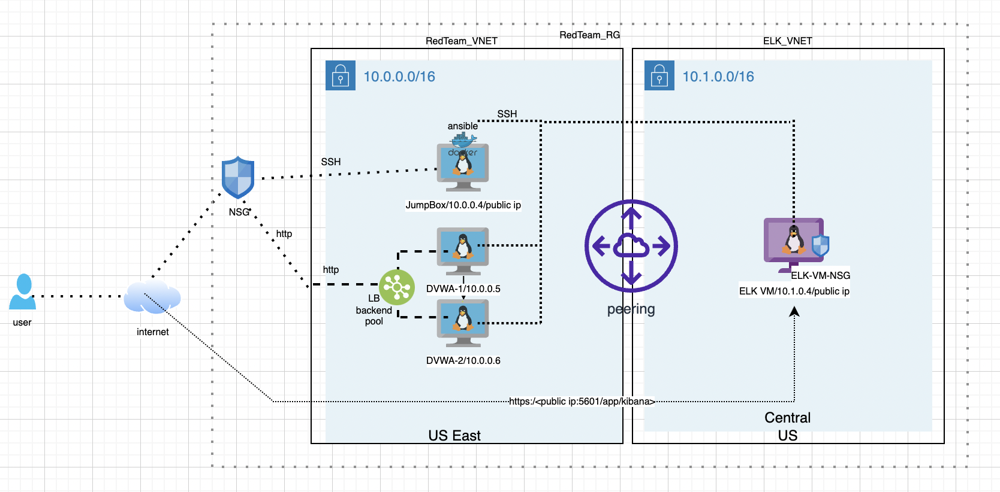

## Automated ELK Stack Deployment

The files in this repository were used to configure the network depicted below.



These files have been tested and used to generate a live ELK deployment on Azure. They can be used to either recreate the entire deployment pictured above. Alternatively, select portions of the Ansible/main.yml to install only certain pieces of it, such as Filebeat.

This document contains the following details:
- Description of the Topology
- Access Policies
- ELK Configuration
  - Beats in Use
  - Machines Being Monitored
- How to Use the Ansible Build


### Description of the Topology

The main purpose of this network is to expose a load-balanced and monitored instance of DVWA, the Damn Vulnerable Web Application.

Load balancing ensures that the application will be highly available, in addition to restricting public access to the network.

Integrating an ELK server allows users to easily monitor the vulnerable VMs for changes to the applications and system statistics.

The configuration details of each machine may be found below.
_Note: Use the [Markdown Table Generator](http://www.tablesgenerator.com/markdown_tables) to add/remove values from the table_.

| Name     | Function   | IP Address | Operating System |
|----------|----------  |------------|------------------|
| Jump Box | Gateway    | 10.0.0.1   | Linux            |
| DVWA-1   | Web Server | 10.0.0.8   | Linux            |                  
| DVWA-2   | Web Server | 10.0.0.9   | Linux            |
| ELK-VM   | ELK Server | 10.1.0.4   | Linux            |

### Access Policies

The machines on the internal network are not exposed to the public Internet. 

Only the jumpbox machine can accept connections from the Internet. Access to this machine is only allowed from the following IP addresses:
- public IP of my local machine

Machines within the network can only be accessed by the ansible docker container running on JumpBox (10.0.0.4).

A summary of the access policies in place can be found in the table below.

| Name     | Publicly Accessible | Allowed IP Addresses |
|----------|---------------------|----------------------|
| Jump Box | Yes                 | My local machine IP  |
| DVWA-1   | No                  | 10.0.0.4,10.1.0.4    |
| DVWA-2   | No                  | 10.0.0.4,10.1.0.4    |
| ELK-VM   | Yes                 | My local machine IP  |

Note: ELK dashboard can be accessed publicly but allowed only my local machine IP. Also DVWA is accessible via public but allowed only my local machine IP. 

### Elk Configuration

Ansible was used to automate configuration of the ELK machine. No configuration was performed manually, which is advantageous because it can be run on anywhere against any target machines to deploy the similar components.

The playbook implements the following tasks:
- install docker
- increase virtual memory
- download and launch ELK docker container
- enable docker service on boot

The following screenshot displays the result of running `docker ps` after successfully configuring the ELK instance.


### Target Machines & Beats
This ELK server is configured to monitor the following machines:
DVWA-1 | 10.0.0.8
DVWA-2 | 10.0.0.9

We have installed the following Beats on these machines:
* filebeat
* metricbeat

These Beats allow us to collect the following information from each machine:
* The system Filebeat module collects and parses logs created by the system logging service of common Unix/Linux based distributions. 
* The system Metricbeat module collects CPU, memory, network, and disk statistics from the host. It collects system wide statistics and statistics per process and filesystem.

### Using the Playbook
In order to use the playbook, you will need to have an Ansible control node already configured. Assuming you have such a control node provisioned: 

SSH into the control node and follow the steps below:
- Copy the ansible/ file to /ansible/. (the target dir may need to create otherwise you can use /etc/ansible dir as well)
- Update the /etc/ansible/hosts file to include the target machines to run the ansible playbook.
- Run the playbook, and navigate to **http://<ELK.VM.External.IP>:5601/app/kibana** to check that the installation worked as expected.

#### Use the steps below to download and run the playbook

```
# SSH to the ansible control machine
# to download
git clone git@github.com:Susanthab/cybersecurity-uod.git
# update the /etc/ansible/hosts file to include ELK-VM and Web servers
# update remote_user in /etc/ansible/ansible.cfg with the user you configured to run the ansible playbook on target machine
# run the command below to configure ELK
$ ansible-playbook ./main.yml
```

### Useful commands
```bash
# check the docker service status 
service docker status

# container status
docker ps -a

# start a container
docker start <container name>

# attack docker container
docker attach <container name>

# run ansible playbook
ansible-playbook ./main.yml
```
